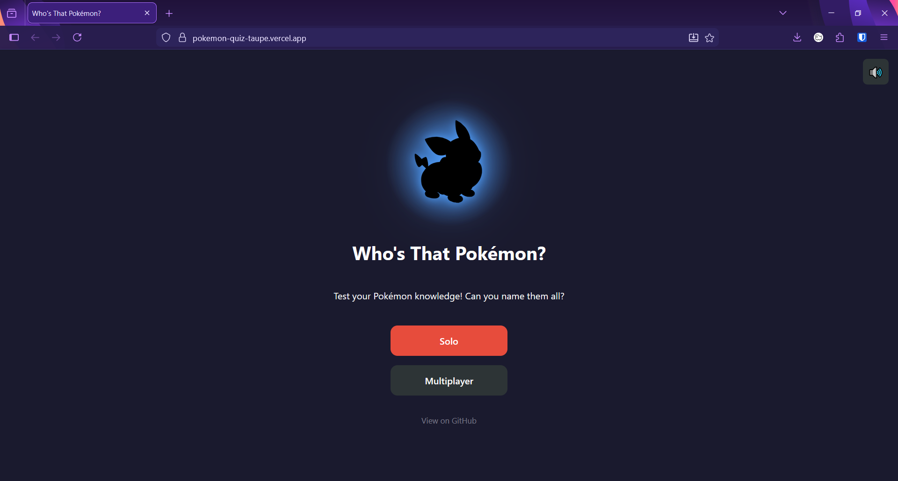
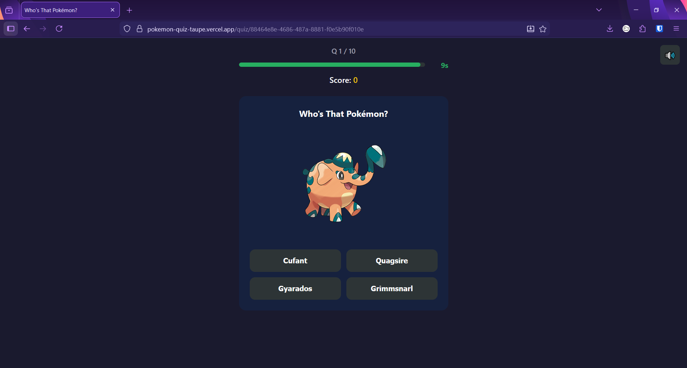

# Who's That Pokémon?

A Pokémon quiz app inspired by the classic "Who's That Pokémon?" segment from the anime. Identify Pokémon from their images — play solo or challenge friends in real-time multiplayer with room codes.

**Live:** [pokemon-quiz-taupe.vercel.app](https://pokemon-quiz-taupe.vercel.app)

### Home Screen


### Quiz Gameplay


---

## Features

- **Single Player** — customisable question count (5–20), timer (5–60s), and hard mode
- **Multiplayer** — up to 20 players via 4-character room codes, real-time sync
- **Hard Mode** — Pokémon shown as silhouettes, revealed after answering
- **Type-Aware Distractors** — wrong answers share types with the correct Pokémon for a fairer challenge
- **Anti-Cheat** — correct answers are never sent to the client before submission
- **Sound Effects & Confetti** — audio feedback and a confetti burst on the results screen
- **Responsive** — works on desktop and mobile
- **Refresh Recovery** — quiz state persists in sessionStorage if you accidentally reload

---

## Tech Stack

| Layer | Technology |
|-------|------------|
| Frontend | React 19, TypeScript, Vite |
| Backend | Vercel Serverless Functions (TypeScript) |
| Database | Upstash Redis (session storage) |
| Real-time | Ably (WebSocket pub/sub with polling fallback) |
| Pokémon Data | [PokéAPI](https://pokeapi.co/) |
| Hosting | Vercel |

---

## Project Structure

```
pokemon-quiz/
├── api/                              # Vercel serverless functions (backend)
│   ├── _lib/                         # Shared server utilities
│   │   ├── ablyService.ts            # Ably real-time event publishing
│   │   ├── nameCleaningService.ts    # PokeAPI name → display name conversion
│   │   ├── pokeApiService.ts         # Pokémon fetching & question generation
│   │   ├── scoringService.ts         # Points calculation (speed bonus)
│   │   ├── sessionService.ts         # Redis-backed session management
│   │   └── types.ts                  # Server-side TypeScript types
│   ├── ably-auth.ts                  # GET  /api/ably-auth — token auth for clients
│   ├── quiz/
│   │   ├── start.ts                  # POST /api/quiz/start — create single-player session
│   │   ├── answer.ts                 # POST /api/quiz/answer — submit an answer
│   │   └── results/
│   │       └── [sessionId].ts        # GET  /api/quiz/results/:id — fetch results
│   ├── multiplayer/
│   │   ├── create.ts                 # POST /api/multiplayer/create — create room
│   │   ├── join.ts                   # POST /api/multiplayer/join — join by room code
│   │   ├── start.ts                  # POST /api/multiplayer/start — host starts game
│   │   ├── answer.ts                 # POST /api/multiplayer/answer — submit answer
│   │   ├── next.ts                   # POST /api/multiplayer/next — advance question
│   │   ├── lobby/
│   │   │   └── [sessionId].ts        # GET  /api/multiplayer/lobby/:id — lobby state
│   │   └── poll/
│   │       └── [sessionId].ts        # GET  /api/multiplayer/poll/:id — polling fallback
│   └── tsconfig.json
├── client/                           # React frontend
│   ├── public/
│   │   └── sounds/                   # Sound effect files (correct, wrong, victory)
│   ├── src/
│   │   ├── components/
│   │   │   ├── Home.tsx              # Landing page with random silhouette
│   │   │   ├── SinglePlayer/         # Solo setup form
│   │   │   ├── Multiplayer/          # Host, join, lobby screens
│   │   │   ├── Quiz/                 # Gameplay UI (question card, timer, options)
│   │   │   ├── Results/              # Score, podium, breakdown, confetti
│   │   │   └── Shared/               # MuteButton, BackButton, LoadingSpinner
│   │   ├── hooks/                    # useQuiz, useMultiplayer, useTimer
│   │   ├── context/                  # SoundContext (mute state + audio playback)
│   │   ├── services/                 # API client, Ably real-time client, sound service
│   │   ├── constants.ts              # Validation limits, defaults
│   │   ├── types.ts                  # Client-side TypeScript types
│   │   ├── App.tsx                   # Router setup
│   │   ├── main.tsx                  # Entry point
│   │   └── index.css                 # All styles
│   ├── index.html
│   ├── vite.config.ts
│   └── package.json
├── docs/
│   └── IMPLEMENTATION_PLAN.md        # Full 18-phase build plan
├── vercel.json                       # Vercel build & routing config
├── package.json                      # Root dependencies (ably, @upstash/redis)
└── .env.example                      # Required environment variables
```

---

## Getting Started (Local Development)

### Prerequisites

- Node.js 18+
- A [Vercel](https://vercel.com) account (for `vercel dev`)

### Setup

```bash
# Clone the repo
git clone https://github.com/adamcordner-dev/pokemon-quiz.git
cd pokemon-quiz

# Install root dependencies
npm install

# Install client dependencies
cd client && npm install && cd ..

# (Optional) Create .env with Ably key for real-time multiplayer
# Without it, multiplayer falls back to 1-second polling
cp .env.example .env
```

### Run locally

```bash
# Start API + client together
npm run dev
```

This runs:
- **API** via `vercel dev` on port 3000
- **Client** via Vite on port 5173 (proxies `/api` requests to port 3000)

Open [http://localhost:5173](http://localhost:5173).

> **Note:** Local development uses a file-backed JSON session store. Production uses Upstash Redis. The Ably real-time key is optional locally — without it, multiplayer uses a polling fallback.

---

## Deployment (Vercel)

The app is deployed as a single Vercel project. The `vercel.json` config handles:
- **Build:** `cd client && npm run build` → outputs to `client/dist`
- **Static files:** served from `client/dist`
- **API routes:** `api/` directory auto-deployed as serverless functions
- **SPA routing:** all non-API routes rewrite to `index.html`

### Environment Variables

Set these in your Vercel project settings:

| Variable | Source |
|----------|--------|
| `UPSTASH_REDIS_REST_URL` | [Upstash](https://upstash.com) Redis database |
| `UPSTASH_REDIS_REST_TOKEN` | Upstash Redis database |
| `ABLY_API_KEY` | [Ably](https://ably.com) app API key |

---

## How It Works

### Question Generation

1. Random Pokémon IDs are selected from the full National Pokédex (1,025+)
2. Each Pokémon's image, types, and species name are fetched from PokéAPI
3. For each question, **2 of the 3 wrong answers** share at least one type with the correct Pokémon — making choices plausible rather than random
4. Alternative forms (e.g. "Giratina Origin") are simplified to the base species name ("Giratina")
5. Form duplicates are filtered so no species appears twice

### Scoring

- **Base points:** 200 for a correct answer
- **Speed bonus:** up to 200 additional points for fast answers (linear scale based on time remaining)
- **Incorrect/timeout:** 0 points

### Anti-Cheat

The correct answer index and name are **never sent to the client** before the player submits. The client receives only the image URL and option text. The server validates and reveals the answer after submission.

### Multiplayer

- Host creates a room → gets a 4-character room code
- Other players join with the code
- Real-time sync via [Ably](https://ably.com) WebSockets (with 1-second polling fallback for local dev)
- Host controls question progression
- Standings update after each question

---

## Sound Effects & Credits

| Sound | Source |
|-------|--------|
| Victory | "Victory! (Wild Pokémon)" from *Pokémon Red & Blue* |
| Correct | Sound Effect by [DRAGON-STUDIO](https://pixabay.com/users/dragon-studio-38165424/?utm_source=link-attribution&utm_medium=referral&utm_campaign=music&utm_content=472358) from [Pixabay](https://pixabay.com/sound-effects//?utm_source=link-attribution&utm_medium=referral&utm_campaign=music&utm_content=472358) |
| Wrong | Sound Effect by [freesound_community](https://pixabay.com/users/freesound_community-46691455/?utm_source=link-attribution&utm_medium=referral&utm_campaign=music&utm_content=47985) from [Pixabay](https://pixabay.com/?utm_source=link-attribution&utm_medium=referral&utm_campaign=music&utm_content=47985) |

---

## Disclaimer

This project is a fan-made quiz for educational and entertainment purposes. It is not affiliated with, endorsed by, or associated with Nintendo, The Pokémon Company, or Game Freak.

- Pokémon names, images, and data are provided by [PokéAPI](https://pokeapi.co/), which sources them from the Pokémon games. All Pokémon-related content is © Nintendo / Creatures Inc. / Game Freak.
- PokéAPI is a free, open-source API. This project respects its fair use policy and caches data where possible to minimise API load.
- This project is open source and generates no revenue.
